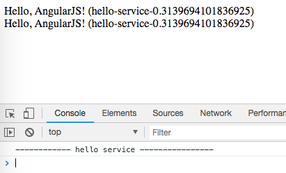

AngularJS1 Service Demo
=======================

`service`，顾名思义，是用来提供一些服务供我们使用，关注点是“功能和行为”。

当我们需要实现一些具体的功能时，应该把它们定义为若干个Service。

在使用service，我们的关注点是功能和行为，与之相应的，`factory`的关注点是结构与数据。

由于service本身需要围绕着某个功能提供若干方法，所以从技术上来说，它应该像`class`一样，是一个“对象构造器”。angularjs将通过`new`来产生它相应的实例。

另外，与factory一样，所有的service都是单例的。

```
npm install
open index.html
```



Resources
---------

- AngularJS1: <https://angularjs.org/>
- AngularJS : Factory and Service? : <https://stackoverflow.com/questions/23074875/angularjs-factory-and-service>
- AngularJS: Service vs provider vs factory: <https://stackoverflow.com/questions/15666048/angularjs-service-vs-provider-vs-factory>
